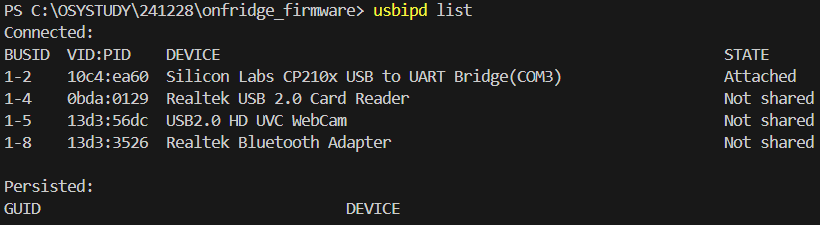
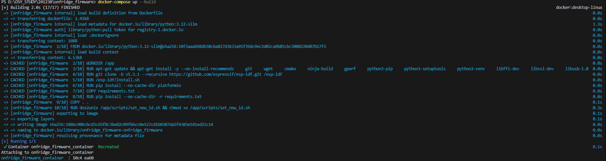
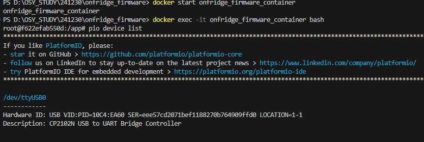

# 온프리지 펌웨어 개발

## 개발 기간 & 개발 환경

- 2024.12.23~
- Docker를 사용하여 개발 환경을 만들었습니다.

## 브랜치 운영 계획(Gitflow)

- **main**: 안정적인 버전
- **release**: 개발 완성된 버전(버그를 여기서 해결)
- **develop**: feature브랜치 통합
- **feature**: 기능 개발

### 브랜치 운영 절차

1. **feature 브랜치에서 개발**: 각 기능 개발은 `feature/xxx`라는 이름의 브랜치에서 작업합니다.
2. 개발이 완료되면 `develop` 브랜치에 해당 `feature` 브랜치를 병합합니다.
3. `main`과 `release` 브랜치는 오상영이 관리합니다.
4. `release`에서 버그 해결을 완료한 후, `main`, `develop`, `feature` 브랜치에 모두 동기화합니다.

## 개발 환경 세팅

1. `git clone https://github.com/hello-osy/onfridge_firmware.git`
2. uspipd 설치(msi파일): https://github.com/dorssel/usbipd-win/releases/tag/v4.3.0

   Silicon Labs CP210X 드라이버 설치(silabser.inf를 우클릭 후, '설치'): https://www.silabs.com/developer-tools/usb-to-uart-bridge-vcp-drivers?tab=downloads

   설치 완료 후, 컴퓨터 재부팅해주세요.

3. usbipd 명령어를 입력해주세요.

```
usbipd list
```

cp210x관련 번호에 맞게, 아래의 명령어를 수정해서 입력하시면 됩니다.(1-1 대신에 다른 숫자일 수도 있음.)

```
usbipd unbind --busid 1-1
usbipd detach --busid 1-1
usbipd bind --busid 1-1
usbipd attach --busid 1-1 --wsl
```

 이렇게 Attached 상태가 되어야 합니다.

권한이 없어서 Access denied된다면,
`Start-Process PowerShell -Verb runAs -ArgumentList "usbipd attach --busid 1-5 --wsl"` 이런 형식으로 명령어를 입력하시면 됩니다.

4. 호스트(컨테이너 밖) 터미널에서, `wsl`입력해서 wsl접속한 다음, `modprobe cp210x`명령어를 입력하고 나서 `exit`해주세요.

5. docker desktop 프로그램을 실행한다.(미리 다운 받으시면 됩니다.)
6. ESP32 개발 보드와 컴퓨터를 선으로 연결하고 나서, `docker-compose up --build`

    이렇게 뜨면 잘 된거에요. ctrl+c해서 나가주세요.

7. GND와 0번포트를 수-수 점퍼케이블로 연결하고 나서, esp32개발 보드의 boot와 en버튼을 15초 정도 눌러주세요.(초기화)
8. `docker start onfridge_firmware_container` -> 컨테이너를 실행하고,
   `docker exec -it onfridge_firmware_container bash` -> 컨테이너 안에서 작업해주세요.
9. `pio device list`에 나오는 포트 이름대로 platform.ini 파일의 upload_port를 수정하시면 됩니다.

    이렇게 뜨면 잘 된거에요.

10. `pio run -t upload`로 코드를 업로드해보세요. `pio run -t uploadfs`를 그 다음에 입력하면 음성 파일도 업로드할 수 있습니다.
11. 회로에 옮겨 꽂았는데 소리 안 나면(speaker.c), en버튼 살짝 누르시면 됩니다.

## Docker 사용 방법

### 1. Docker Desktop 설치 및 실행

- Docker Desktop을 설치하고 실행합니다.

### 2. Docker 이미지 빌드(vscode 터미널에서 하면 됨)

전체 빌드는 처음에 1번만 하시면 됩니다.

- 전체 빌드:

```bash
docker-compose up --build
```

- 전체 빌드 후 도커 컨테이너 백그라운드 실행:

```bash
docker-compose up -d --build
```

- 도커 컨테이너 중지 및 제거

```bash
docker-compose down
```

- docker 빌드 캐시 삭제 명령:

```bash
docker builder prune
docker image prune -a
docker volume prune
docker system prune -a --volumes
```

### 3. 호스트에서 수정한 코드를 도커 컨테이너에 반영

- 도커 컨테이너 내부로 파일 복사하기

```
docker cp ./sound_receiver.py onfridge_firmware_container:/app/sound_receiver.py
docker cp ./src/microphone.c onfridge_firmware_container:/app/src/microphone.c
```

- 컨테이너 진입

```
docker restart onfridge_firmware_container
docker exec -it onfridge_firmware_container bash
```

컨테이너를 restart해줘야 포트 오류가 안 생깁니다.

### 4. 도커 컨테이너에서 수정한 코드를 호스트에 반영

- 도커 컨테이너에서 호스트로 파일 복사(주의!!!)

```
docker cp onfridge_firmware_container:/app/sound_receiver.py ./sound_receiver.py
docker cp onfridge_firmware_container:/app/src/microphone.c ./src/microphone.c

docker cp onfridge_firmware_container:/app/received_audio.wav ./received_audio.wav
```

## 개발할 때

### 1. 로컬 브랜치 생성 및 전환

```

git checkout -b feature/xxx

```

- `feature/xxx`라는 이름의 로컬 브랜치를 생성하고 해당 브랜치로 이동합니다.
- 로컬에 이미 feature/xxx가 있으면 -b는 빼도 됩니다.

### 2. 원격 저장소와 동기화

```

git pull origin feature/xxx

```

- 원격 저장소의 `feature/xxx`와 로컬의 `feature/xxx`를 동기화합니다.

### 3. 개발 후 커밋 및 푸시

- 개발을 완료한 후, 변경 사항을 커밋하고 푸시합니다.

```

git add .
git commit -m "커밋 제목"
git push origin feature/xxx

```

### 4. 브랜치 병합 (feature → develop)

1. `develop` 브랜치로 이동:

```

git checkout develop

```

2. `feature/xxx` 브랜치를 `develop` 브랜치에 병합:

```

git merge feature/xxx

```

## Platformio 명령어

1. ESP32에 코드 업로드

```

pio run -t upload

```

2. ESP32의 SPIFFS에 업로드(음성 파일 같은 거)

```

pio run -t uploadfs

```

3. UART Monitor 확인

```

pio device monitor

```

4. ESP-IDF 프로젝트 설정 변경

```

pio run -t menuconfig

```

5. ESP-IDF 프로젝트 캐시 초기화

```

pio run --target clean

```

6. PlatformIO에서 사용 가능한 직렬 포트를 확인

```

pio device list

```

## tmux & socat & minicom 사용 방법(`pio device monitor` 대신에 사용하는 프로그램)

1. 일단 그냥 pio device monitor 사용하시는게 나을 듯 합니다.(minicom하고 python 동시에 실행하면 오류 뜨네요. 따로따로 하셔야 할 것 같습니다. 문제를 해결해볼게요.)
2. `tmux` 새로운 tmux 세션이 열립니다.
3. `pkill -f "socat -d -d /dev/ttyUSB0"` `socat -d -d /dev/ttyUSB0,raw,echo=0 PTY,link=/tmp/ttyV0 &` 명령어를 입력하고 `Enter`를 한 번 더 눌러주세요. 첫 번째 창에서 socat을 실행하여 ESP32의 실제 UART 포트(/dev/ttyUSB0)를 가상 포트(/tmp/ttyV0)로 연결합니다.
4. `python sound_receiver.py > /tmp/python_logs.txt` 첫 번째 tmux 창에서 프로그램을 실행해주세요.
5. tmux에서 새로운 창을 열기 위해 `Ctrl + B`누르고, 그다음 `"` 키를 눌러 세션을 두 개로 분할합니다.
6. `minicom -D /dev/ttyUSB0 -b 115200` 두 번째 tmux 창에서 실제 포트(/dev/ttyUSB0)를 minicom으로 모니터링하여 ESP32 로그를 확인합니다.
7. `Ctrl + B`누르고, 위쪽 화살표 버튼 누르면 위쪽 화면으로 가고, 아래쪽 화살표 버튼 누르면 아래쪽 화면으로 갑니다.(`Ctrl + B`는 vim의 esc키 같은 느낌입니다.)
8. minicom에서는 `Ctrl + A`누르면 명령 모드로 진입하고, `X`키를 누르면 minicom이 종료됩니다.
9. `ps aux | grep socat`해서 나온 애들을 `kill -9 139 182 254 255`같은 명령어로 중복 실행된 socat 프로세스들을 지워주세요.
10. 창 하나 더 만드시고, `cat /tmp/python_logs.txt`하면 파이썬 로그도 볼 수 있어요.
11. 모든 창을 균등하게 나누고 싶을 경우: `Ctrl + B, Alt + 1`

## 포트가 잠겼을 때

1. `lsof /dev/ttyUSB0` 현재 /dev/ttyUSB0를 사용하는 프로세스를 확인합니다.

2. `kill -9 1234` 위 출력에서 확인한 PID를 종료합니다. 1234는 실제 점유 중인 프로세스의 PID로 변경하세요.

## 웨이크 워드 구현

1. '리지야' 음성 데이터 및 다른 음성 데이터 수집
2. Tensorflow로 음성 구분 모델 훈련
3. 훈련된 모델을 c배열로 바꾸고 헤더파일로 만들어서, .c파일에서 가져다가 쓰도록 만들어준다.
4. 최적화 및 테스트(Low-pass Filter, Moving Average Filter, 저전력 모드, Threshold 값 조정, 다양한 배경 소음에서 웨이크 워드 테스트)

## 참고 사항

1. 특정 파일만 빌드해서 업로드하고 싶으면 src/CMakeLists.txt파일을 수정하면 됩니다.
2. platformio.ini에 정의된 속도와 .c파일에 정의된 속도가 동일한지 확인하세요.
3. `docker compose up --build`가 지나치게 빠르게 되면서 espidf 관련 오류가 뜨면, docker 캐시를 삭제하고 다시 빌드해주세요.
4.

```

usbipd unbind --busid 1-1
usbipd detach --busid 1-1
usbipd list
usbipd bind --busid 1-1
usbipd attach --busid 1-1 --wsl

dmesg | grep usb
ls -l /dev/ttyUSB0

echo "10c4 ea60" | tee /sys/bus/usb-serial/drivers/cp210x/new_id

```

5. 컴퓨터에 docker-desktop외의 다른 배포판이 wsl기본값으로 설정되어있으면 오류가 생길 수 있습니다.
   `wsl --list --verbose`로 WSL 배포판 이름을 확인하시고, `wsl --unregister <distribution_name>`로 사용하지 않는 WSL 배포판을 삭제해주세요.
6. `aplay received_audio.wav` 형식의 명령어로 wav파일을 재생할 수 있습니다.
7. `hexdump -C received_audio.raw` 형식의 명령어로 raw파일을 볼 수 있습니다.
8. usb를 뺐다가 꽂을 때마다, `usbipd attach --busid 1-1 --wsl`명령어를 입력하고, 호스트(컨테이너 밖) 터미널에서, `wsl`입력해서 wsl접속한 다음, `modprobe cp210x`명령어를 입력하고 나서 `exit`해야 합니다. 그래야 docker container에서 esp32 개발 보드를 인식할 수 있습니다.(usb 선은 웬만하면 뽑지 않는 것이 좋을 것 같습니다.)
9. 도커 컨테이너 내에서 vim 또는 nano로 개발할 수도 있습니다. 개발하신 내용을 호스트에도(컨테이너 밖) 반영해서 git으로 공유해주세요~
10. `pio run -t upload`하면 알아서 컴파일하고 업로드하는 것입니다. 따로 컴파일할 필요가 없습니다.
